# GoogleIoT
This project is based on nodemcu mictocontroller board.

### Introduction to Google Cloud IoT

#### 1. What is Google IOT cloud

Google IoT services collects real-time data from IoT devices, at the edge or in the cloud. This is a fully managed service provided by Google. It allows to us to securely connect, ingest and manage data from IoT devices. The combination of Cloud IoT Core with other services on Google's cloud platform provide us a complete package to collect, manage, process and visualize Iot data. 

### 2. Benefits Of Google Cloud for IoT devices

IoT(Internet of Things) generates lots of data. We need an efficient,affordable and  scalable method to manage these devices.There comes Google cloud in picture.  It provides  a coherent mechanism to handle the informations generated by the devices. Google Cloud provides a platform to store, analyze and process the data.  

####  Key Features of Google cloud IoT

1. **Google cloud provides tools for all our IoT applications starting fom ingestion to intelligence.**
2. **It lets us automatically predicts when equipment needs maintenance.**
3. **It provides feature of Real-time asset tracking.**

### 3. Device Management in Google Cloud:

#### 1. IoT Core device manager:

This is a fully managed service. IoT Core device manager manages the devices in the google cloud.It handles registration, authentication, and authorization inside the Google Cloud resource hierarchy as well as device metadata stored in the cloud. It has the ability to send device configuration from the service to devices.

#### 2. Ingestion:

It is a process of importing data from devices into the Google Cloud services. Depending upon the data like whether it is telemetry or operational information about the devices, Google cloud provides different ingestion services.

#### 3. IoT Core MQTT:

MQTT stands for Message Queue Telemetry Transport. It is a messgaing protocol for the Internet of Things.
It is an OASIS standard protocol used for IoT connectivity. It is a publish/subscribe, extremely simple and lightweight messaging protocol, designed for constrained devices and low-bandwidth, high-latency or unreliable networks.

IoT Core provides a secure MQTT broker for IoT devices that are managed by IoT core. The IoT core MQTT broker directly connects with Google cloud Pub/Sub. The advantages of using this protocol is that with the help of configuration management feature, it can send real-time telemetry data and  can immediately receive messages sent from the cloud to the device.

#### 4.Pub/Sub

It gives globally durable message ingestion service. It helps to connect to other Google Cloud services like ingestion, data pipe lines and storage systems. If we create topics for streams/channels , we can enable different components of our application in order to subscribe to certain streams of data. We do not need to construct subscriber-specific channels on our IoT devices.

### Introduction to Project on Google IoT

#### Project Title: Google Based IoT Cloud Service -   Weather Temperature Monitoring

#### Hardware Requirements:
1. Microcontroller -  Nodemcu esp8266 
2. Sensor -  BME 280
3. Breadboard
4. Jumper Wires
5. USB cable

### Flow Diagram Of Project

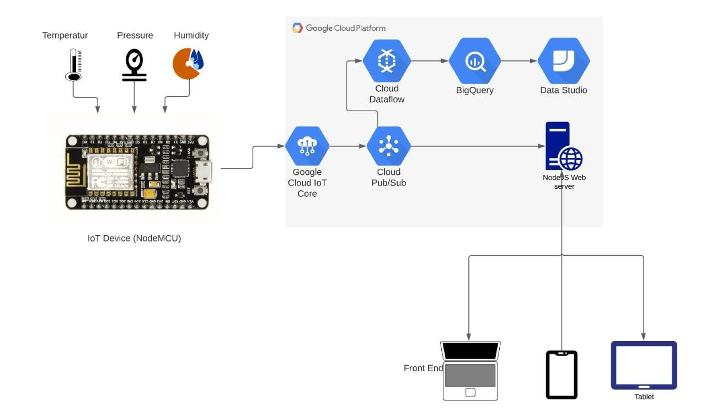

### Steps

#### 1. Read data From the sensor with microcontroller

ESP8266 Arduino code prints BME280 sensor data temperature, pressure, humidity, altitude to the Arduino Serial Plotter (9600)

####  2. MQTT bridge 

MQTT client running on ESP8266  collects data from BME280 and sends to Google cloud IoT

It uses Google Cloud IoT Core JWT and Arduino MQTT libraries

##### a. MQTT Client

Uses the Google Cloud IoT Core JWT and Arduino MQTT libraries

##### b. MQTT Bridge

Connects IoT device to Google Cloud IoT Core using MQTT Mosquitto.

#### 3. Setup MQTT in google cloud

##### 1. Creating Google Pub/Sub Topic in Google Cloud

To create a Cloud Pub/Sub topic, run:

	gcloud pubsub topics create mytopic
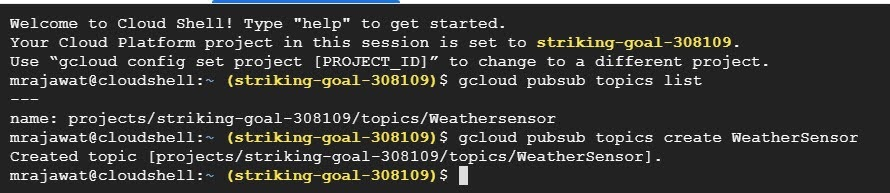

##### 2. Creating Subscription on Pub/Sub

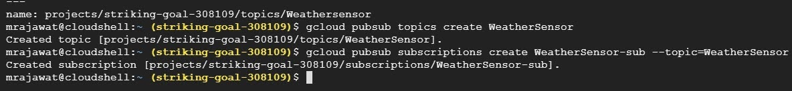

##### 3. publishing Message on Pub sub
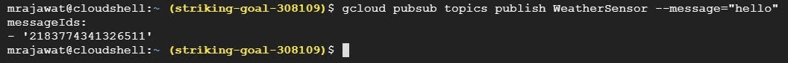

##### 4. listening on pub/sub
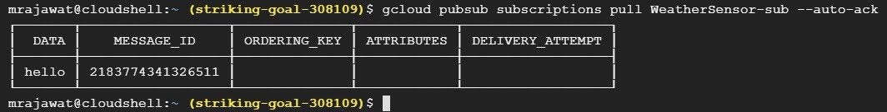

#### 4. Registtry and device creation on Google Cloud

#####  Create Registry for the Project

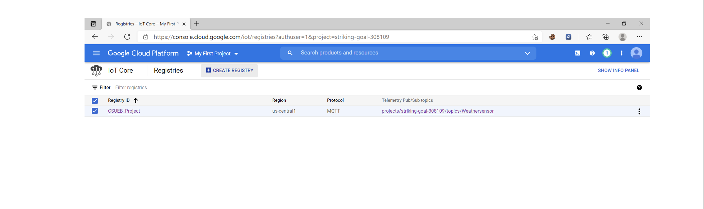

#####  Set Registry Properties 

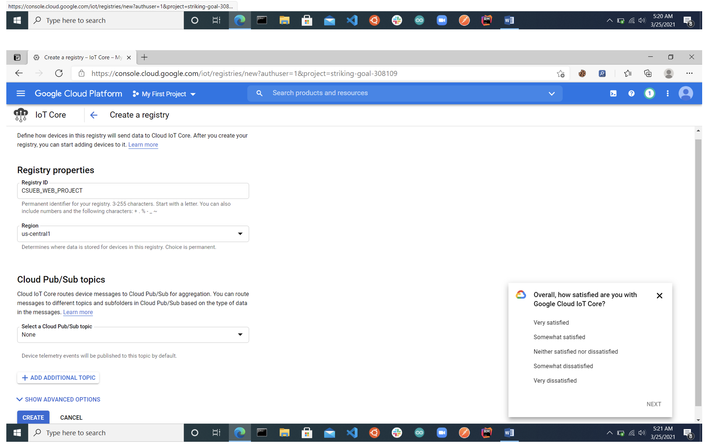

##### In cloud Pub/Sub topics create a topic

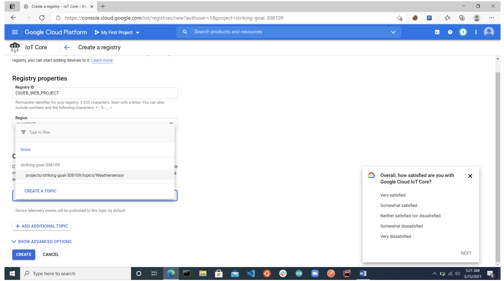

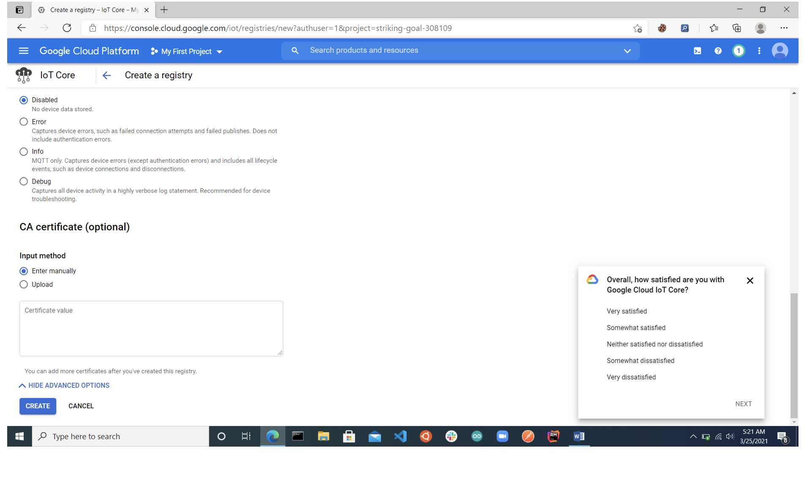

##### Registry created details
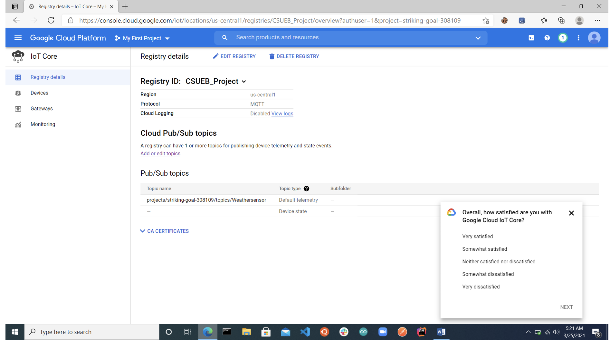

##### Go to devices and select CREATE  A DEVICE

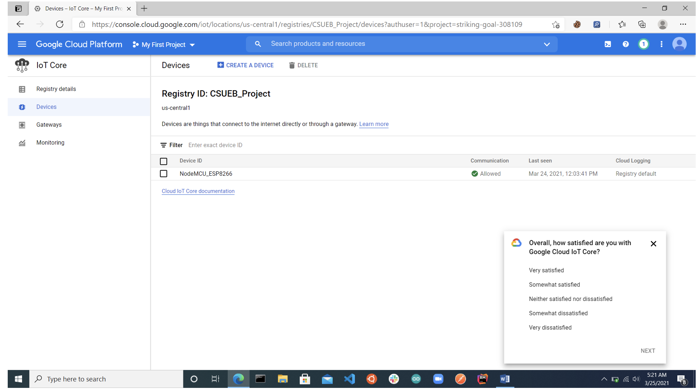

##### Add Device ID and click create
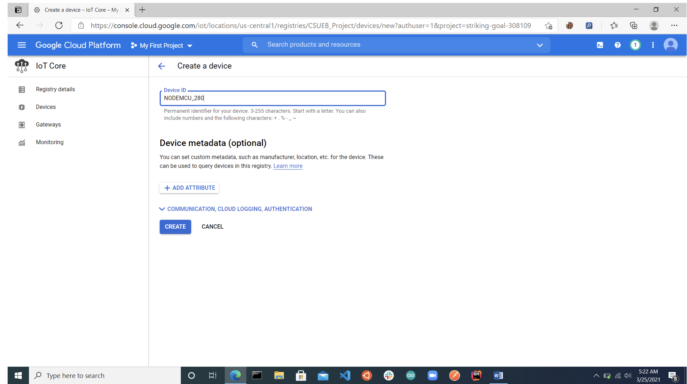

##### In Registry details you can see your device details
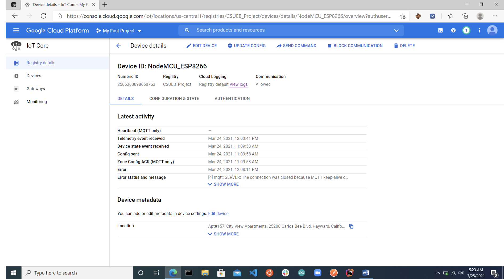

